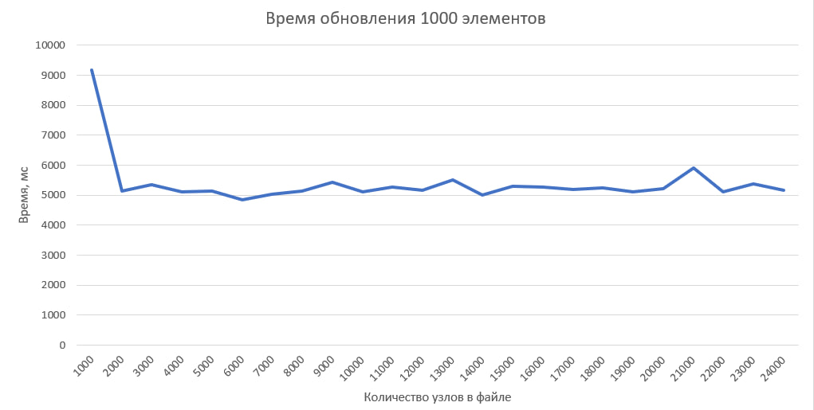

# Низкоуровневое программирование
## Лабораторная работа №1
## Степанов Михаил Анреевич P33312

### Вариант №3
### Граф узлов с атрибутами

#### Зависимости

* Clang
* CMake 3.24 и выше

#### Сборка и запуск

Linux: 
`bash ./Lab1/nix.sh`

Windows:

```
cd ..
mkdir build
cd build
cmake .. -D CMAKE_C_COMPILER="C:\msys64\mingw64\bin\clang.exe" -D CMAKE_CXX_COMPILER="C:\msys64\mingw64\bin\clang++.exe"
cmake --build . --target ALL_BUILD --config Release
```

### Цели

Создать модуль, реализующий хранение в одном файле данных (выборку, размещение и гранулярное
обновление) информации общим объёмом от 10GB соответствующего варианту вида.

### Задачи

* Спроектировать структуры данных для представления информации в оперативной памяти
    - Для порции данных. Поддержать тривиальные значения по меньшей мере следующих типов: цетырёхбайтовые целые числа и числа с плавающей точкой, текстовые строки произвольной длины, булевские значения
    - Для информации о запросе
* Спроектировать представление данных с учетом схемы для файла данных и реализовать базовые операции для работы с ним:
    - Операции над схемой данных (создание и удаление колонок)
    - Базовые операции над элементами данных в соответствии с текущим состоянием схемы (над записями заданного вида)
        1. Вставка элемента данных
        2. Перечисление элементов данных
        3. Обновление элемента данных
        4. Удаление элемента данных
* Используя в сигнатурах только структуры данных из п.1, реализовать публичный интерфейс со следующими операциями над файлом данных:
    - Добавление, удаление и получение информации о элементах схемы данных, размещаемых в файле данных, на уровне, соответствующем виду записей
    - Добавление нового элемента данных определённого вида
    - Выборка набора элементов данных с учётом заданных условий и отношений со смежными элементами данных (по свойствам/полями/атрибутам и логическим связям соответственно)
    - Обновление элементов данных, соответствующих заданным условиям
    - Удаление элементов данных, соответствующих заданным условиям
* Реализовать тестовую программу для демонстрации работоспособности решения

### Описание работы

* `node` - именованный узел семантической сети
```c++
struct node {
    int32_t id{};
    std::string node_name;
    std::string node_class;
    std::unordered_map<std::string, property> props;
    std::unordered_map<std::string, relationship> relations;
}
```

* `property` - именованная характеристика узла
```c++
struct property {
    enum type {INT, BOOL, FLOAT, STRING};
    type tag;
    int32_t int_val;
    bool bool_val{};
    float float_val{};
    std::string string_val;
}
```

* `relationship` - именованное отношение между узлами
```c++
struct relationship {
    std::string name;
    std::string related_with;
}
```

* `meta` - метаинформация о хранящихся данных
```c++
struct meta{
    int32_t node_count = 0;
    std::vector<int32_t> free;
    std::unordered_map<std::string, int32_t> node_names;
    std::unordered_map<std::string, std::unordered_set<int32_t>> node_classes;
}
```

### Аспекты реализации
* Первые 256 Мб файла отведены под метаинформацию о данных, записывающихся в файл
* Каждый узел занимает 4 Кб памяти
* Доступ к конкретному узлу осуществляется за O(1), благодаря использованию unordered_map при записи данных о node в метаинформацию
* При удалении элемента удаляется только метаинформация об этом элементе, при последующем обращении к записи память под удаленный элемент будет занята новым элементом
* Сериализация и десериализация осуществляется с помощью библиотеки `cereal`

### Результаты




### Вывод
В результате выполнения лабораторной работы был разработан модуль, реализующий хранение в одном файле данных в виде графа узлов с атрибутами, объем которых может достигать 10GB. Модуль поддерживает операции select, insert, update, delete. Модуль может работать под управлением ОС семейств Windows и *NIX.